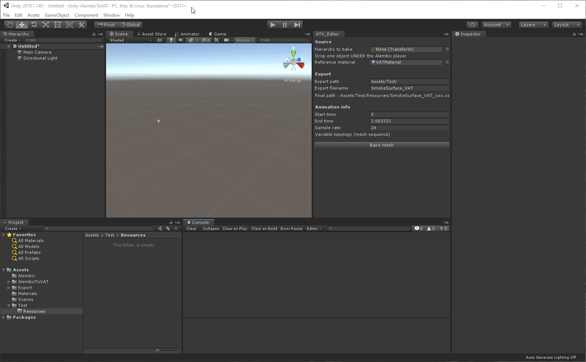
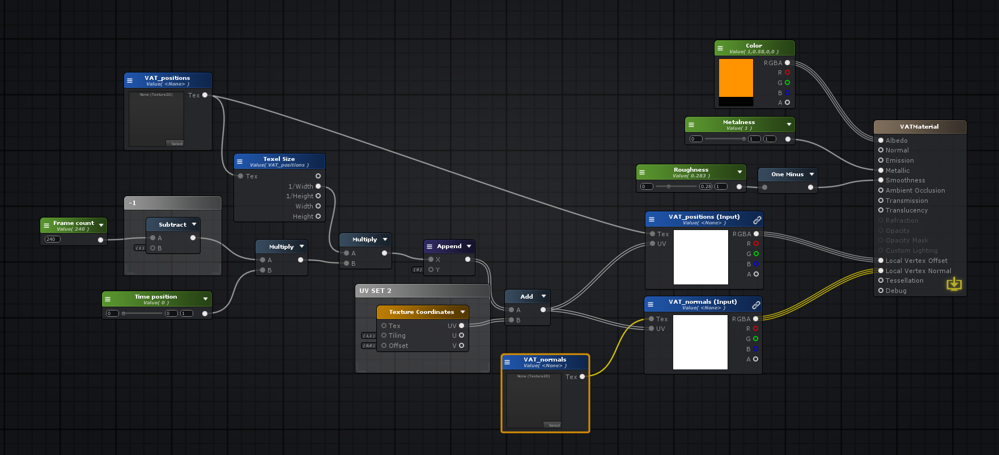

Alembic to VAT (Vertex Animation Texture) converter for Unity
===============================================================

This is a repository that contains a simple tool to convert Alembic files
to Vertex Animation textures.

It's working for the simple cases I've tested, you may find cases with
issues ... I'm aware of that, but that project is provided AS IS, I will 
not provide any support for this, you have the code, you have some samples
and it's provided for free.

System requirements
-------------------

- Unity 2019.1.14f1 
- Alembic package
- Editor coroutine package

How to use Alembic to VAT converter
-------------------------------------
 
Be sure to have the Alembic and Editor coroutine package installed in your project

- Drop an alembic file in your scene
- Open the converter window (Window > Alembic to VAT)
- Drop one of the element of the Alembic object in 'Hierarchy to bake'. It's NOT the Alembic object itself, only one of its child. You can have several animated object in the Alembic file, this is only converting ONE.
- This will animated the Alembic file once and update the Animation info in the converter window. This will tell you if you have a Variable topology animation (different meshes every frames) or a Fixed topology animation (same mesh morphed between frames)
- Enter the directory where you will export it (Export path). By default it's Assets/Export/(Resources). The directory is NOT created automatically by the tool, you have to do it yourself. The path HAS to end with a 'Resources' directory
- Enter the filename for the export (Export filename)
- Check that the final path is what you want (Final path - read only).
- If the export directory does not exist ... create it
- Once you're happy with all of these, you can bake the animation with the 'Bake mesh' button. Depending on the complexity of your Alembic file, this may take some time.

What does it generates?
-------------------------
Once done, all your resources are created and imported in your project automatically. You can drop the xxx_prefab object created and drop it in your scene. To animate the VAT, just change the Time position in the material. 

The tool have generated 2 textures : 
- xxx_position that contains the positions of the vertices relative to the first frame of the animation.
- xxx_normal that contains the aniamted normals in model space.
You will also have a base mesh, a material and a ready to use prefab

The Amplify shader material
---------------------------
 

Creating you own compatible shader
----------------------------------
The provided shader has been made with Amplify shader editor and you can easily modify it to match your needs.
If you want to create an HLSL shader or HDRP/URP shader, it's pretty straight forward.
You need : 
A texture property called _VAT_positions where you'll have your vertex positions texture
A texture property called _VAT_normals where you'll have your vertex normals texture
A float property called _Framecount that will contain the number of frames in your animation (NOT the duration, the frame count)

In your vertex shader :
The RGB of the VAT_normals texture will be the XYZ of the local vertex normal - it's already in a half format texture, you DON'T need to multiply by 2 subtract 1 like you do on a normal
The RGB of the VAT_positions texture will be added to your vertex local position (or set as your Local vertex offset)
The texture coordinates to access those 2 textures are in the SECOND UV SET, not the first one. So you can keep the texturing on your object
To this UV2 you have to add to the X component the offset to go to the wanted frame. So it will be something like frameNumber*1/Texture width.

Alembic samples provided in the project
---------------------------------------
You can use freely the provided Alembic files, it's just simple tests, feel free to do whatever you want with them

When will this be updated?
--------------------------
I may or may not update that project again, I have no plans for the moment ... it was just a 2-3 days quick project made to help my students use more efficiently their Alembic files, on any platform, for a very cheap cost.

Can I use this tool freely?
---------------------------
Feel free to use the tool in your projects, improve it, modify it ... 
Just don't sell it and make profit out of it please, it is free on purpose. 